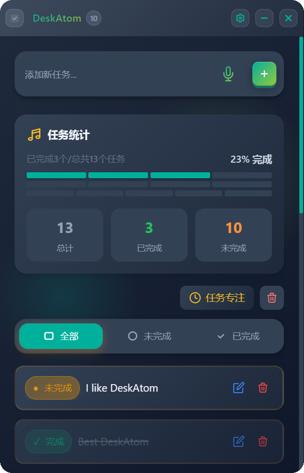
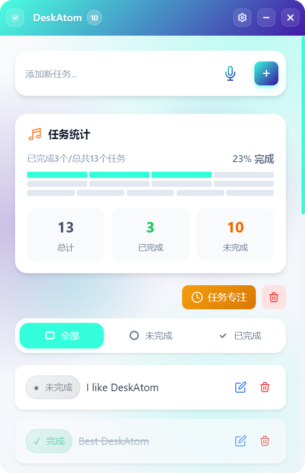
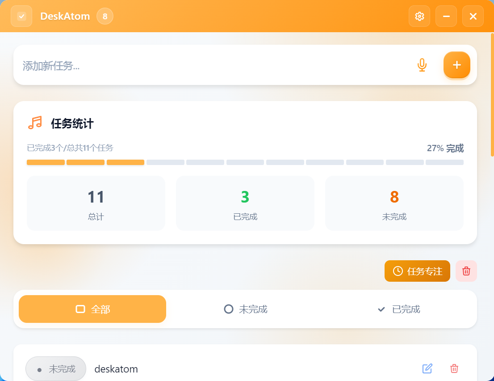
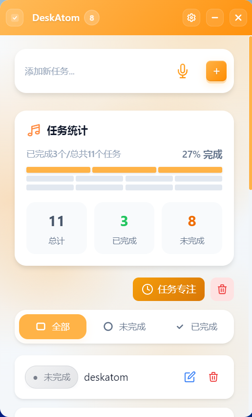

# DeskAtom

[](README_EN.md)
[](README.md)


**现代化的任务管理桌面应用**

一个简洁、高效、美观的任务管理工具，帮助你专注于重要的事情

[快速开始](#-快速开始) • [功能特性](#-功能特性) • [技术栈](#️-技术栈)

***

## ✨ 功能特性

### 📝 任务管理


简洁现代的 UI 设计，展示任务列表、统计信息和筛选器

- **添加任务** - 快速添加新任务，支持回车键快速提交
- **删除任务** - 删除任务前有确认对话框，防止误删
- **标记完成** - 点击任务前的圆圈标记任务为已完成
- **拖拽排序** - 支持拖拽任务卡片进行排序
- **批量删除** - 一键清除所有任务


支持文字输入和语音输入两种方式添加任务

### 🔍 任务筛选

- **全部任务** - 查看所有任务
- **未完成** - 只显示待处理的任务
- **已完成** - 只显示已完成的任务
- **流畅动画** - 筛选切换时有平滑的过渡动画

### 🗂️ 分组任务

- **高一级分组** - 先选择任务分组，再在分组内切换全部、未完成、已完成
- **默认收件箱** - 新任务默认进入当前分组；在所有任务中添加时进入收件箱
- **多分组归属** - 一个任务可以同时属于多个分组，适合交叉项目和复合场景
- **分组管理** - 支持创建、重命名、删除和重排分组
- **安全删除分组** - 删除分组时可选择仅删除分组，或同时删除该分组中的独占任务

### 🤖 AI 分解任务

- **长文本拆分** - 在“添加新任务”中输入一大段内容后，可让 AI 拆分成多个短任务
- **已有任务拆分** - 可对单个已有任务进行 AI 分解，原任务默认保留
- **发送前编辑** - 调用 AI 前可编辑实际发送内容，适配长文本和补充背景
- **数量控制** - 支持无要求、准确数量，以及大约 `x ~ y` 个任务的区间控制
- **结果预览** - AI 结果不会直接写入，可先编辑任务文本、删除不需要的条目
- **补充后重试** - 如果 AI 猜测了不准确的信息，可补充说明并重新分解
- **写入分组** - 拆分结果可新建建议分组，也可并入当前分组或已有分组

### 📊 任务统计

- **实时统计** - 显示任务总数、已完成数、未完成数
- **进度条** - 可视化显示任务完成进度
- **百分比显示** - 精确显示完成百分比

### 🎯 专注模式


透明背景，只显示未完成任务，沉浸式工作体验

- **沉浸式体验** - 透明背景，只显示未完成任务
- **自定义颜色** - 可自定义任务项颜色
- **智能文字颜色** - 根据背景亮度自动调整文字颜色
- **快捷操作** - 在专注模式下直接标记完成或删除任务


暗夜模式下的专注模式，护眼又专注


可调节专注模式的透明度，适应不同工作环境

### 🌙 暗夜模式



- **深色主题** - 护眼的深色配色方案
- **全局适配** - 所有界面元素都完美适配暗夜模式
- **一键切换** - 快速在明亮/暗夜模式间切换

### 🎨 个性化定制


个性化定制主题色、透明度、专注模式配色等选项

- **主题色自定义** - 自定义应用主题颜色
- **窗口透明度** - 调节窗口透明度（30%-100%）
- **专注模式配色** - 自定义专注模式任务项颜色


可调节窗口透明度，打造个性化桌面体验


担心浅色下字体和图标看不见？做了浅色适配，滑到浅色自动把字体和图标换为深色。



支持单色、双色渐变等多种配色方案

### 🖥️ 窗口管理


最小化为小型指示器，节省屏幕空间，支持拖拽定位，自动吸附屏幕边缘

- **始终置顶** - 窗口始终保持在最前端
- **多屏幕支持** - 完美支持多显示器环境
- **窗口缩放** - 支持自由调整窗口大小
- **最小尺寸限制** - 窗口最小 185x100 像素
- **指示器模式** - 最小化为小型指示器，节省屏幕空间

### 📱 响应式设计






- **自适应布局** - 界面元素根据窗口大小自动调整
- **移动端友好** - 在小窗口下也能完美显示
- **灵活换行** - 筛选按钮和统计卡片自动换行

### 💾 数据存储

- **本地存储** - 任务数据保存在本地，保护隐私
- **分组持久化** - 分组、任务归属和排序会随任务数据一起保存
- **AI 配置保存** - OpenAI 兼容服务配置保存在本地配置文件中
- **自动保存** - 任务变更自动保存，无需手动操作
- **持久化** - 关闭应用后数据不丢失

### 🎯 Windows 任务栏集成

- **任务栏徽章** - 在任务栏图标上显示未完成任务数
- **悬停提示** - 鼠标悬停显示任务统计信息

***

## 🚀 快速开始

### 前置要求

- Node.js 16+
- pnpm（推荐）或 npm

### 1. 安装依赖

```bash
git clone https://github.com/hecoococ/DeskAtom.git
cd DeskAtom
pnpm install
```

### 2. 开发模式运行

```bash
pnpm electron:dev
```

这会同时启动：

- Vite 开发服务器 (<http://localhost:1420>)
- Electron 应用窗口

### 3. 构建生产版本

```bash
pnpm electron:build
```

构建产物位于 `release` 目录下。

***

## 🔌 DeskAtom MCP Server

DeskAtom MCP Server 是一个可独立安装和发布的本地 stdio MCP 工具。Claude Desktop、Cursor、Codex 等 MCP client 可以通过它调用 `deskatom_*` 工具来管理 DeskAtom 的任务、分组和 AI 拆分。

MCP Server 与桌面应用共享同一份本地数据，但它不是桌面窗口的一部分。安装 DeskAtom 桌面应用后，MCP 不会自动启用；需要在 MCP client 中手动添加 stdio 配置。

### 数据位置

- 默认数据目录：`%APPDATA%\DeskAtom`
- 任务数据：`%APPDATA%\DeskAtom\tasks.json`
- AI 配置：`%APPDATA%\DeskAtom\ai-settings.json`
- 桌面端和 MCP server 共用这份本地数据。

### 推荐方式：npm / npx

发布到 npm 后，用户不需要手动下载和安装 MCP Server，只要本机安装了 Node.js，即可在 MCP client 中使用 `npx` 自动拉取并运行：

```json
{
  "mcpServers": {
    "deskatom": {
      "command": "npx",
      "args": ["-y", "deskatom-mcp-server@latest"]
    }
  }
}
```

如果 Windows 客户端找不到 `npx`，可改用 `cmd` 包一层：

```json
{
  "mcpServers": {
    "deskatom": {
      "command": "cmd",
      "args": ["/c", "npx", "-y", "deskatom-mcp-server@latest"]
    }
  }
}
```

这种方式适合大多数用户。升级时重启 MCP client，`npx` 会按版本参数拉取对应包；如果希望固定版本，可以把 `latest` 改成具体版本号，例如 `deskatom-mcp-server@2.7.0`。

### 备用方式：GitHub Release Zip

GitHub Release 中也建议保留 MCP Server zip 包，方便不想使用 npm 自动拉取的用户下载。例如：

```text
deskatom-mcp-server-v2.7.0.zip
```

压缩包中建议包含：

```text
deskatom-mcp-server/
├── mcpServer.js
├── taskStore.js
├── aiService.js
├── package.json
├── package-lock.json
└── README.md
```

用户下载后解压，在该目录运行：

```bash
npm install --omit=dev
```

然后把解压目录中的 `mcpServer.js` 绝对路径配置到 MCP client。也可以随 release 提供已安装依赖的完整压缩包，但体积会更大，跨平台兼容性也更依赖打包时的 Node 环境。

### 本地安装位置

打包安装后的 Electron 文件通常在 `app.asar` 中，不建议直接让 Node.js 执行安装目录里的 `mcpServer.js`。推荐把 MCP server 放在固定目录，例如：

```text
D:\MCP Server\deskatom-mcp-server
```

该目录至少需要包含：

```text
deskatom-mcp-server/
├── mcpServer.js
├── taskStore.js
├── aiService.js
├── package.json
└── node_modules/
```

如果没有 `node_modules`，先在该目录安装依赖：

```bash
cd "D:\MCP Server\deskatom-mcp-server"
npm install
```

确认 MCP server 能启动：

```bash
node "D:\MCP Server\deskatom-mcp-server\mcpServer.js"
```

手动运行时进程会等待 MCP client 通过 stdio 通信，停在那里是正常的，按 `Ctrl+C` 退出即可。

### Claude Desktop 配置示例

打开配置文件：

```text
%APPDATA%\Claude\claude_desktop_config.json
```

加入：

```json
{
  "mcpServers": {
    "deskatom": {
      "command": "npx",
      "args": ["-y", "deskatom-mcp-server@latest"]
    }
  }
}
```

保存后重启 Claude Desktop。

如果使用 GitHub zip 解压安装，则把配置改为：

```json
{
  "mcpServers": {
    "deskatom": {
      "command": "node",
      "args": [
        "D:\\MCP Server\\deskatom-mcp-server\\mcpServer.js"
      ]
    }
  }
}
```

### Cursor / Codex 配置思路

在 MCP 配置中添加 stdio server：

```json
{
  "name": "deskatom",
  "command": "npx",
  "args": ["-y", "deskatom-mcp-server@latest"]
}
```

不同客户端的外层 JSON 字段可能不同，但核心都是：

- npm/npx 方式：`command` 为 `npx`，`args` 为 `["-y", "deskatom-mcp-server@latest"]`
- GitHub zip 方式：`command` 为 `node`，`args` 指向 `mcpServer.js` 的绝对路径

配置完成后重启对应 MCP client，工具列表中应该能看到 `deskatom_*` 工具。

### 发布 MCP Server

发布前先检查：

```bash
pnpm mcp:check
pnpm mcp:publish:dry-run
```

发布到 npm：

```bash
npm login
pnpm mcp:publish
```

生成 GitHub Release zip：

```bash
pnpm mcp:zip
```

生成的压缩包位于：

```text
release/deskatom-mcp-server-v2.7.0.zip
```

### 从源码运行 MCP

开发时可直接运行：

```bash
pnpm mcp:start
```

或在 MCP client 中配置：

```json
{
  "mcpServers": {
    "deskatom": {
      "command": "node",
      "args": [
        "D:\\大学文档\\俊涛html\\electron-todo-desktop\\electron\\mcpServer.js"
      ]
    }
  }
}
```

源码运行适合开发和调试。正式使用时仍建议配置独立 MCP Server 目录，避免桌面应用源码路径变化影响 MCP client。

### 可用能力

- 查询任务、统计任务数量
- 添加单个或批量任务
- 修改任务文本、完成状态和分组
- 批量完成、删除、清空和重排任务
- 创建、重命名、删除和重排分组
- 批量管理任务分组归属
- AI 拆分文本为任务，并将预览结果写入新分组或已有分组

### 常见问题

- **客户端看不到工具**：检查 Node.js 是否已安装，并确认 `mcpServer.js` 使用绝对路径。
- **npx 启动失败**：确认已安装 Node.js，并尝试把 `command` 改为 `cmd`，`args` 改为 `["/c", "npx", "-y", "deskatom-mcp-server@latest"]`。
- **路径包含反斜杠报错**：JSON 中 Windows 路径需要写成 `D:\\MCP Server\\...`。
- **AI 拆分不可用**：先在 DeskAtom 设置面板中配置 AI 服务，或确认 `%APPDATA%\DeskAtom\ai-settings.json` 已保存 API Key、Base URL 和模型。
- **桌面端没同步最新任务**：当前版本不做实时外部变更监听，MCP 修改后可重启或刷新桌面端查看最新数据。

### GitHub Release 建议

如果同时发布桌面应用和 MCP Server，建议 release 产物分开命名：

```text
DeskAtom-Setup-2.7.0.exe
DeskAtom-2.7.0.AppImage
DeskAtom-2.7.0.dmg
deskatom-mcp-server-v2.7.0.zip
```

桌面安装包负责图形界面，MCP Server 压缩包负责给 MCP client 调用。两者通过本机数据目录共享任务数据，因此可以独立更新，但建议保持相同版本号，方便排查兼容问题。

***

## 📁 项目结构

```
DeskAtom/
├── electron/              # Electron 主进程
│   ├── main.js           # 主进程入口
│   ├── preload.js        # 预加载脚本（主窗口）
│   └── preload-indicator.js  # 预加载脚本（指示器）
├── src/                  # Vue 源代码
│   ├── components/       # Vue 组件
│   │   ├── TitleBar.vue         # 标题栏
│   │   ├── TodoItem.vue         # 任务项
│   │   ├── SettingsPanel.vue    # 设置面板
│   │   ├── FocusMode.vue        # 专注模式
│   │   ├── ColorPicker.vue      # 颜色选择器
│   │   ├── OpacitySlider.vue    # 透明度滑块
│   │   └── ConfirmDialog.vue    # 确认对话框
│   ├── App.vue           # 根组件
│   ├── main.js           # Vue 入口
│   └── style.css         # 全局样式
├── public/               # 静态资源
│   └── indicator.html    # 指示器页面
├── build/                # 构建资源
│   └── icons/            # 应用图标
├── index.html            # HTML 模板
├── package.json          # 项目配置
├── vite.config.js        # Vite 配置
├── tailwind.config.js    # Tailwind 配置
└── postcss.config.js     # PostCSS 配置
```

***

## 🛠️ 技术栈

| 技术               | 说明                |
| ---------------- | ----------------- |
| **Vue 3**        | 渐进式 JavaScript 框架 |
| **Electron**     | 跨平台桌面应用框架         |
| **Vite**         | 下一代前端构建工具         |
| **Tailwind CSS** | 实用优先的 CSS 框架      |
| **pnpm**         | 快速、节省磁盘空间的包管理器    |

***

## 🎯 使用技巧

1. **快速添加任务** - 点击空状态区域或使用输入框快速添加任务
2. **批量操作** - 使用筛选器快速查看特定状态的任务
3. **专注工作** - 开启专注模式，排除干扰，专注于当前任务
4. **个性化设置** - 在设置面板中自定义主题色、透明度和专注模式配色
5. **多显示器** - 应用会记住在哪个显示器上使用，下次启动时自动定位

***

## 🔧 开发脚本

| 命令                    | 说明               |
| --------------------- | ---------------- |
| `pnpm dev`            | 仅启动 Vite 开发服务器   |
| `pnpm build`          | 构建 Vue 应用        |
| `pnpm preview`        | 预览构建结果           |
| `pnpm mcp:start`      | 启动本地 MCP server   |
| `pnpm electron:dev`   | 启动 Electron 开发模式 |
| `pnpm electron:build` | 构建可执行文件          |

***

## 📝 注意事项

- 开发模式下，Electron 会自动打开开发者工具
- 任务数据保存在本地存储中，保护您的隐私
- 应用窗口默认宽度 320px，高度为屏幕高度
- Windows 系统支持任务栏图标徽章显示未完成任务数

***

## 🤝 贡献

欢迎提交 Issue 和 Pull Request！

***

## 📄 许可证

MIT License

***

<div align="center">

**DeskAtom** - 让任务管理变得简单而优雅

Made with ❤️ by Hecoococ

</div>
