# DeskAtom

[](README_EN.md)
[](README.md)


**A Modern Task Manager for Your Desktop**

Simple, efficient, and beautiful — helps you focus on what really matters

[Quick Start](#-quick-start) • [Features](#-features) • [Tech Stack](#️-tech-stack)

***

## ✨ Features

### 📝 Task Management

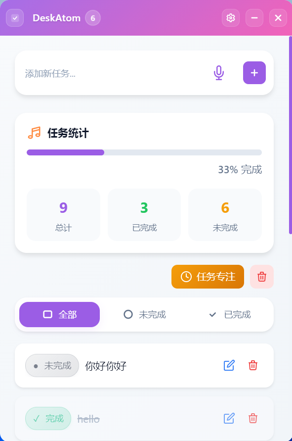

Clean and modern UI design — your tasks, stats, and filters all in one place

- **Add Tasks** - Quick add with Enter key, because who has time for extra clicks?
- **Delete Tasks** - With confirmation dialog, so you won't accidentally nuke your todo list
- **Mark Complete** - Click the circle to check it off. So satisfying!
- **Drag & Drop** - Reorder tasks like a boss
- **Bulk Delete** - Clear everything in one go when you need a fresh start

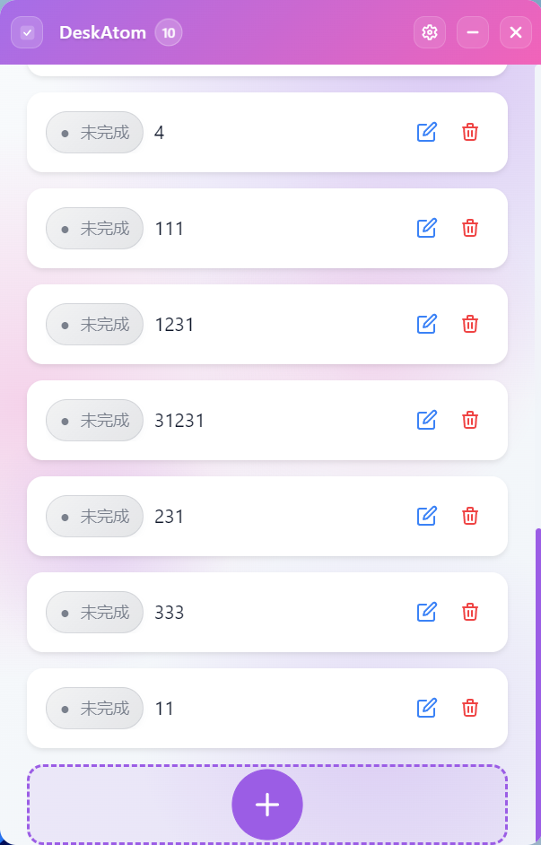

Type it or speak it — we support both text and voice input for adding tasks!

### 🔍 Task Filtering

- **All Tasks** - See everything you've got going on
- **Active** - Just the stuff you still need to do
- **Completed** - Admire your accomplishments
- **Smooth Animations** - Because switching views should feel nice

### 📊 Task Statistics

- **Real-time Stats** - Total, done, and pending — all the numbers at a glance
- **Progress Bar** - Visual progress because numbers alone are boring
- **Percentage Display** - Precisely how much you've crushed it

### 🎯 Focus Mode

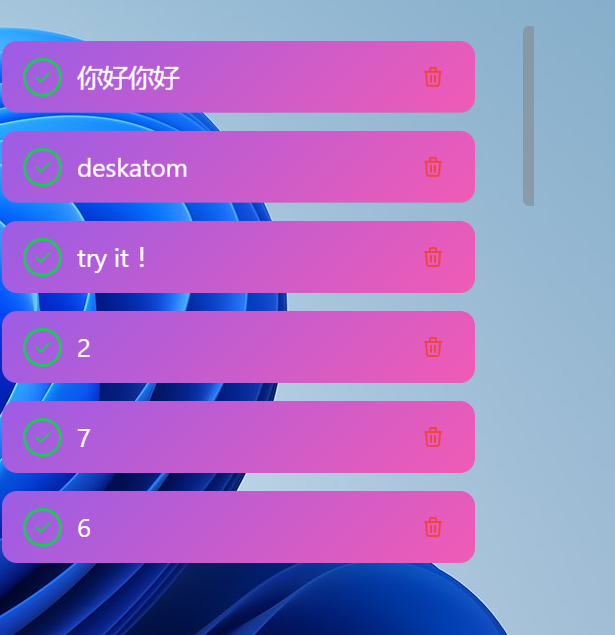

Transparent background, only unfinished tasks — get in the zone!

- **Immersive Experience** - Just you and your tasks, nothing else
- **Custom Colors** - Make it yours with custom task colors
- **Smart Text Color** - Text automatically adjusts to stay readable
- **Quick Actions** - Mark complete or delete without leaving focus mode

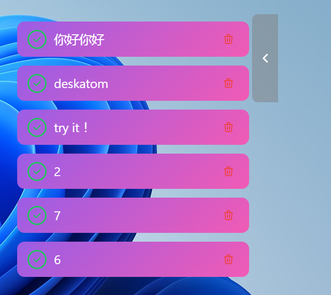

Entered focus mode and can't find the exit? Here's a secret: the scrollbar is actually the exit button! 🎉

### 🌙 Dark Mode

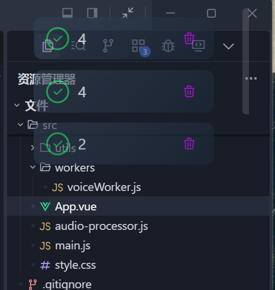

Dark mode focus — easy on the eyes, perfect for late-night productivity

- **Dark Theme** - Easy on the eyes, especially at 2 AM
- **Full Adaptation** - Every element looks great in dark mode
- **One-Click Toggle** - Switch between light and dark instantly

### 🎨 Personalization

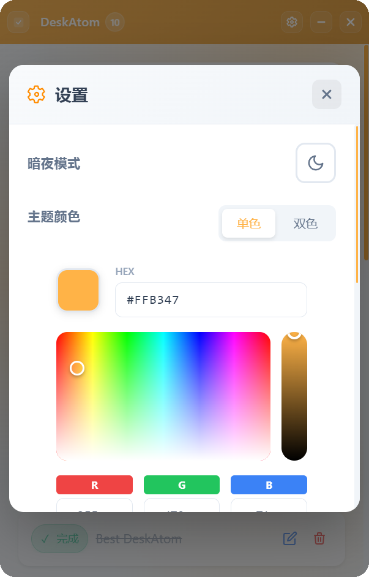

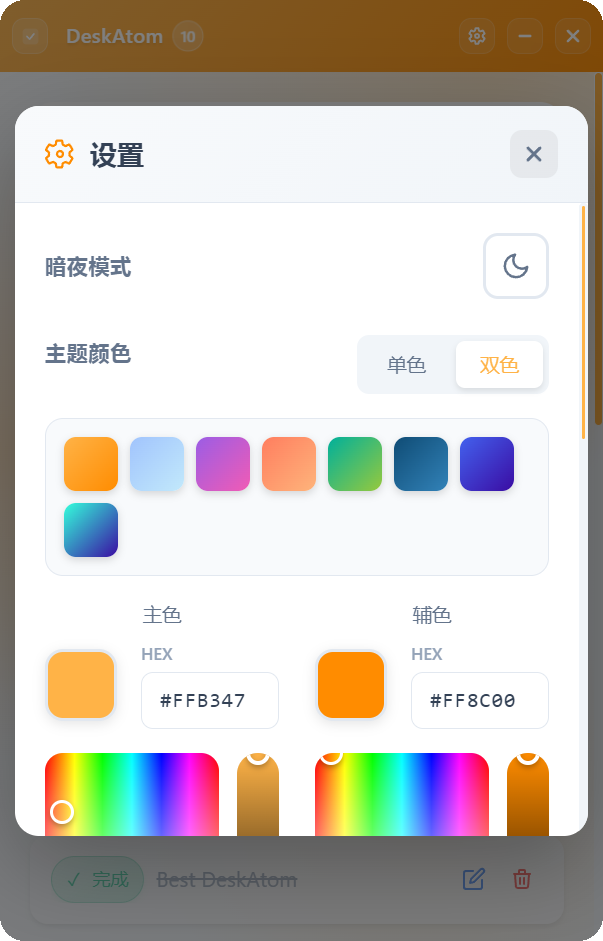

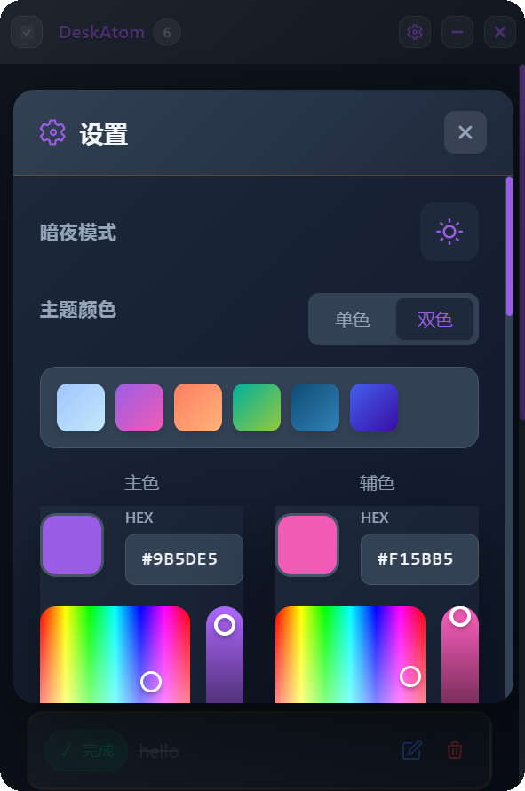

Make it truly yours — customize theme color, transparency, and focus mode colors

- **Custom Theme Color** - Pick your favorite color, we won't judge
- **Window Transparency** - From 30% to 100%, ghost mode to solid
- **Focus Mode Colors** - Custom colors for your focus zone

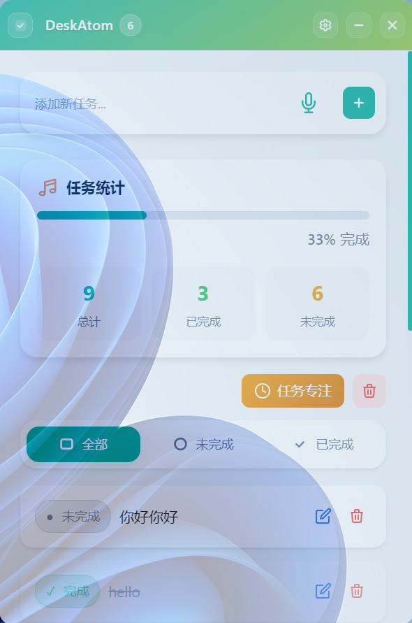

Adjust window transparency for that personalized desktop experience

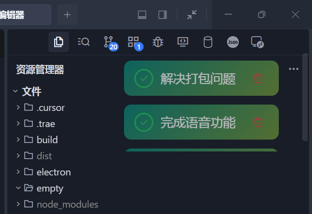

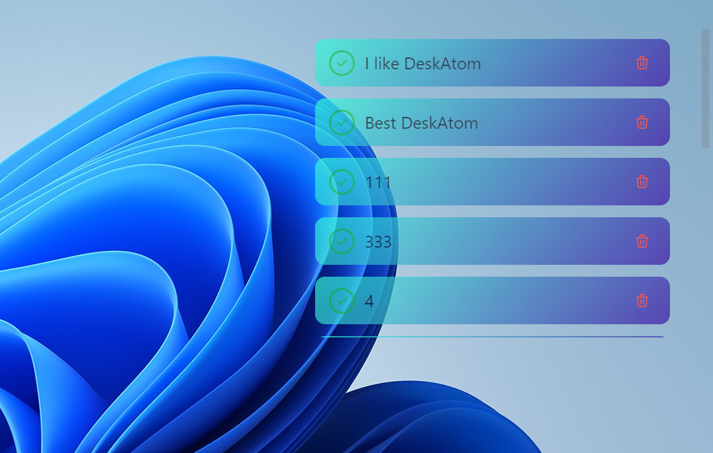

Focus mode transparency works too! Resize your window before entering focus mode to get the perfect size.

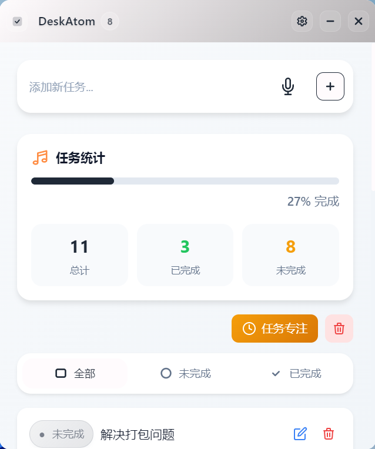

Worried about light colors making text invisible? We've got you covered — text and icons automatically switch to dark colors on light backgrounds. Smart, right?

### 🖥️ Window Management

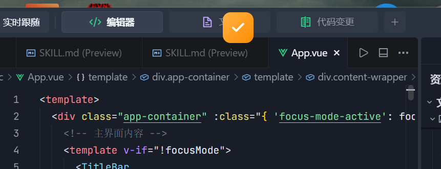

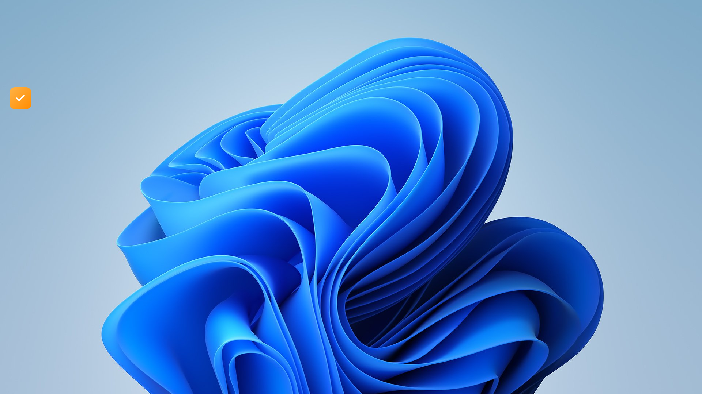

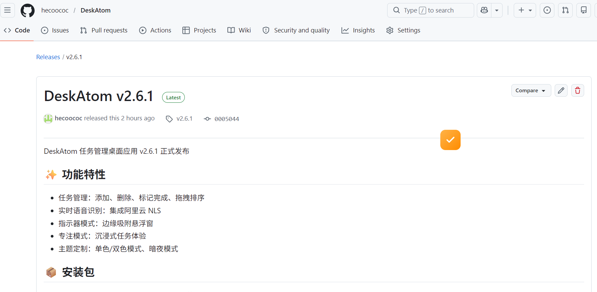

Minimize to a tiny indicator — saves screen space, supports drag positioning, and snaps to screen edges

- **Always on Top** - Stay above everything else
- **Multi-Monitor Support** - Works perfectly with multiple displays
- **Resizable** - Make it as big or small as you need
- **Minimum Size** - At least 185x100 pixels, we're not monsters
- **Indicator Mode** - Tiny mode for when you need every pixel

### 💾 Data Storage

- **Local Storage** - Your data stays on your computer, private and secure
- **Auto-Save** - Changes save automatically, because manual save is so 2010
- **Persistent** - Close the app, your tasks are still there when you come back

### 🎯 Windows Taskbar Integration

- **Taskbar Badge** - Shows your unfinished task count right on the icon
- **Hover Tooltip** - Hover for quick stats without opening the window

### 📱 Responsive Design

- **Adaptive Layout** - Elements adjust to window size automatically
- **Small Window Friendly** - Works great even in tiny windows
- **Flexible Wrapping** - Buttons and cards wrap nicely

***

## 🚀 Quick Start

### Prerequisites

- Node.js 16+
- pnpm (recommended) or npm

### 1. Install Dependencies

```bash
git clone [repository-url]
cd electron-todo-desktop
pnpm install
```

### 2. Run in Development Mode

```bash
pnpm electron:dev
```

This starts both:
- Vite dev server (http://localhost:1420)
- Electron app window

### 3. Build for Production

```bash
pnpm electron:build
```

Find your built app in the `release` directory.

***

## 📁 Project Structure

```
electron-todo-desktop/
├── electron/              # Electron main process
│   ├── main.js           # Main process entry
│   ├── preload.js        # Preload script (main window)
│   └── preload-indicator.js  # Preload script (indicator)
├── src/                  # Vue source code
│   ├── components/       # Vue components
│   │   ├── TitleBar.vue         # Title bar
│   │   ├── TodoItem.vue         # Task item
│   │   ├── SettingsPanel.vue    # Settings panel
│   │   ├── FocusMode.vue        # Focus mode
│   │   ├── ColorPicker.vue      # Color picker
│   │   ├── OpacitySlider.vue    # Opacity slider
│   │   └── ConfirmDialog.vue    # Confirm dialog
│   ├── App.vue           # Root component
│   ├── main.js           # Vue entry
│   └── style.css         # Global styles
├── public/               # Static assets
│   └── indicator.html    # Indicator page
├── build/                # Build resources
│   └── icons/            # App icons
├── index.html            # HTML template
├── package.json          # Project config
├── vite.config.js        # Vite config
├── tailwind.config.js    # Tailwind config
└── postcss.config.js     # PostCSS config
```

***

## 🛠️ Tech Stack

| Tech               | Description                |
| ------------------ | -------------------------- |
| **Vue 3**          | Progressive JavaScript framework |
| **Electron**       | Cross-platform desktop apps |
| **Vite**           | Next-gen frontend build tool |
| **Tailwind CSS**   | Utility-first CSS framework |
| **pnpm**           | Fast, disk-efficient package manager |

***

## 🎯 Tips & Tricks

1. **Quick Add** - Click empty space or use the input box to add tasks fast
2. **Bulk Operations** - Use filters to quickly find specific tasks
3. **Get in the Zone** - Turn on focus mode and crush your tasks
4. **Make it Yours** - Customize theme, transparency, and colors in settings
5. **Multi-Monitor** - The app remembers which monitor you used last

***

## 🔧 Scripts

| Command               | Description              |
| --------------------- | ------------------------ |
| `pnpm dev`            | Start Vite dev server only |
| `pnpm build`          | Build Vue app            |
| `pnpm preview`        | Preview build result     |
| `pnpm electron:dev`   | Start Electron dev mode  |
| `pnpm electron:build` | Build executable         |

***

## 📝 Notes

- Dev mode opens DevTools automatically
- Your data is stored locally — your privacy is protected
- Default window width is 320px, height matches your screen
- Windows taskbar badge shows unfinished task count

***

## 🤝 Contributing

Issues and Pull Requests are welcome! Let's make this even better together.

***

## 📄 License

MIT License

***

<div align="center">

**DeskAtom** — Making task management simple and elegant

Made with ❤️ by Hecoococ

</div>
